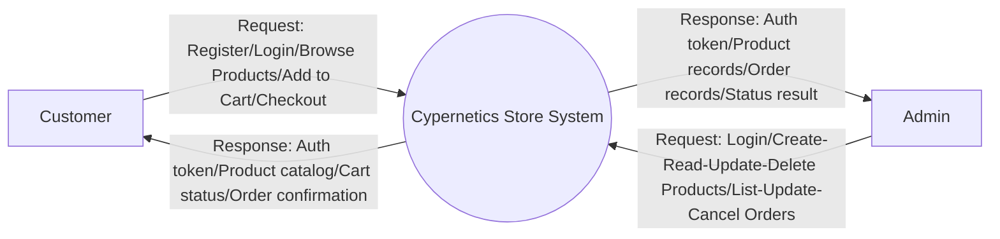
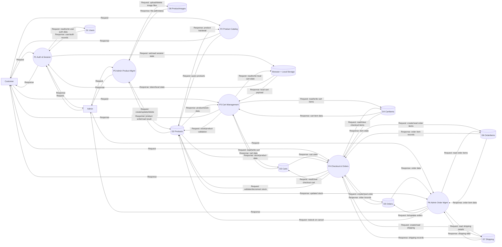
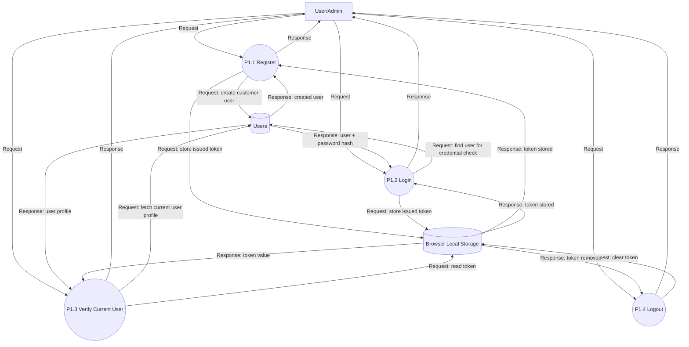
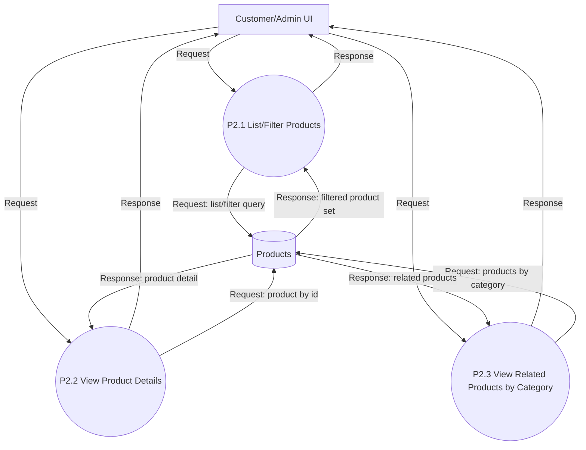
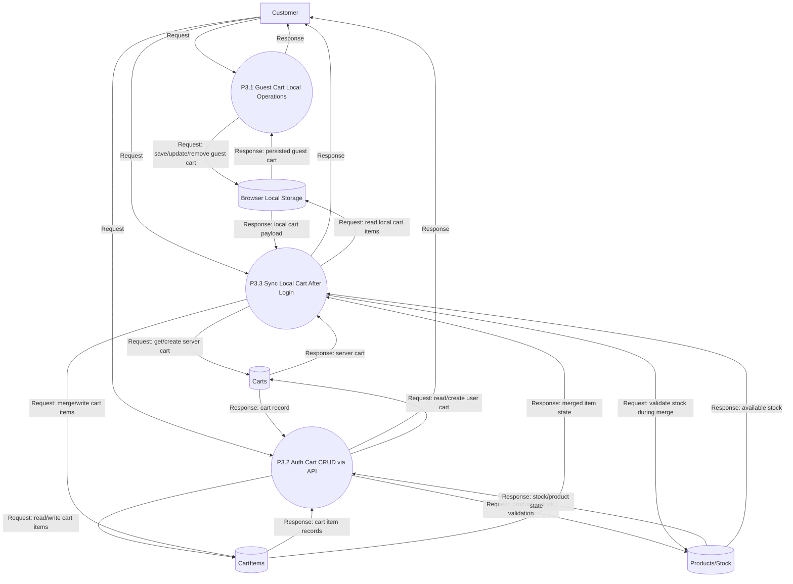
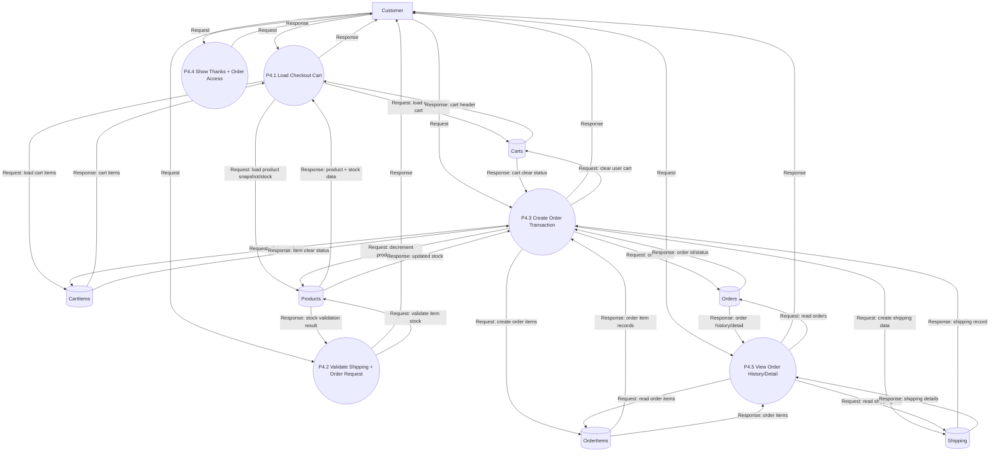
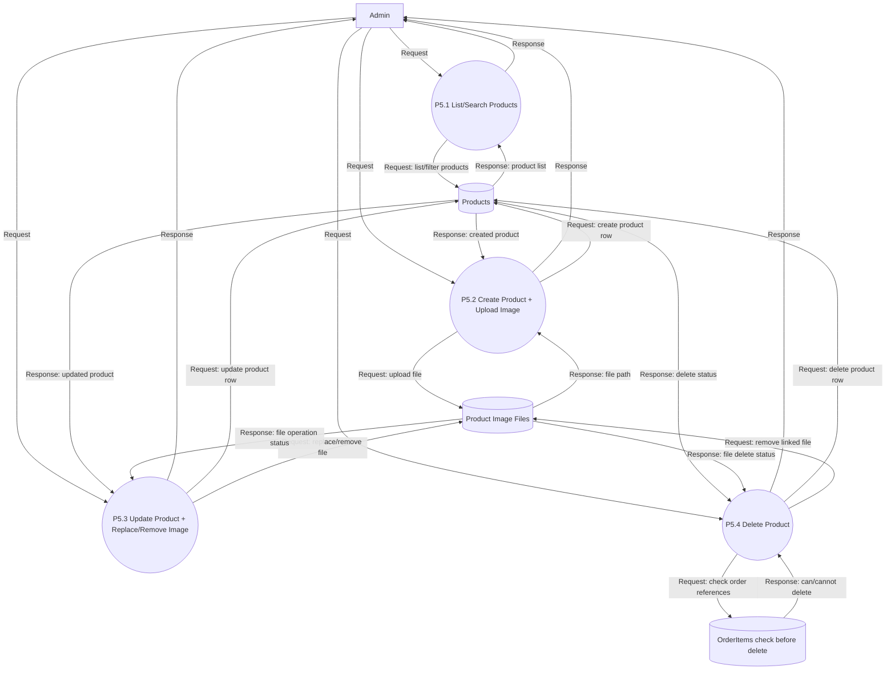
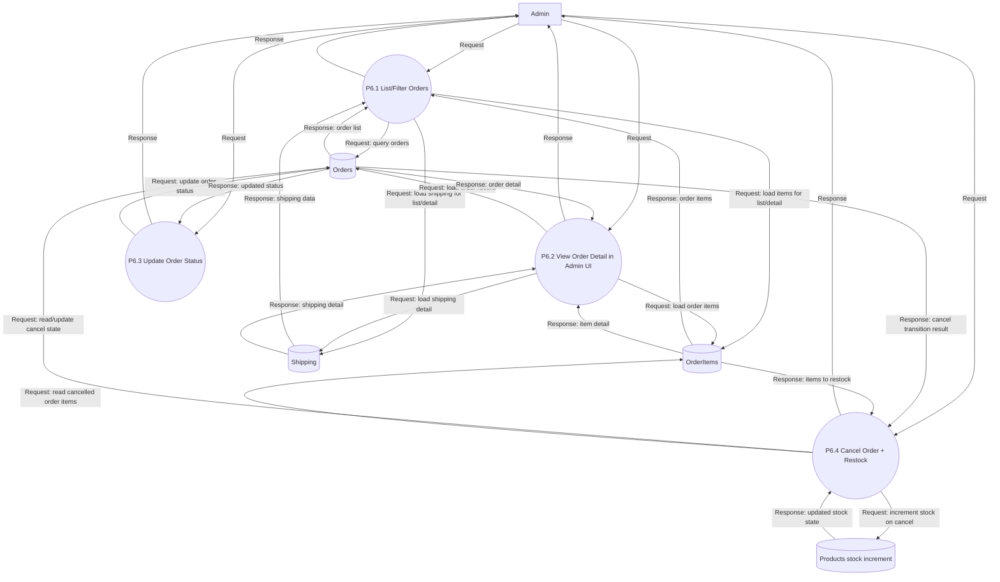

# Data Flow Diagram (DFD) - Cypernetics Store

This document models data movement for the current implementation across customer and admin flows.

## 1) Scope and System Boundary

**System**: Cypernetics Store (Next.js app + API routes + Prisma/SQLite)

**Primary Actors**
- Customer (guest or authenticated)
- Admin

**External/Supporting Components**
- Browser / Frontend UI (pages, forms, cart sheet)
- Local Storage (JWT token + persisted guest cart/auth state)
- File System for product images (`public/uploads/products`)

**Core Data Stores**
- `D1 Users` (`User`)
- `D2 Products` (`Product`)
- `D3 Carts` (`Cart`)
- `D4 CartItems` (`CartItem`)
- `D5 Orders` (`Order`)
- `D6 OrderItems` (`OrderItem`)
- `D7 Shipping` (`Shipping`)
- `D8 ProductImages` (uploaded image files on disk)

---

## 2) Context Diagram

### Context Notes
- **Customer**: Registers, logs in, browses products, manages cart, places orders, views order history.
- **Admin**: Logs in with admin role, manages product inventory (CRUD), manages orders (view/update status/cancel with stock restock).
- Both actors use JWT-based authentication and communicate via REST APIs.

---

## 3) Level 0 DFD

### Level 0 Processes
- `P1` Authentication & Session
- `P2` Product Catalog & Product Details
- `P3` Cart Management (Guest + Authenticated)
- `P4` Checkout & Order Lifecycle
- `P5` Admin Product Management
- `P6` Admin Order Management

---

## 4) Level 1 DFD (Process Decomposition)

## P1 - Authentication & Session

**Behavior**
- `P1.1 Register`: validate input, ensure unique email, hash password, create `customer`, issue JWT.
- `P1.2 Login`: verify credentials, issue JWT with role.
- `P1.3 Verify Current User`: validate token, fetch user profile.
- `P1.4 Logout`: client-side token removal; API endpoint returns success message.

## P2 - Product Catalog & Product Details

**Behavior**
- `P2.1` supports search, category, price range, sort, pagination.
- `P2.2` fetches a single product by id.
- `P2.3` fetches products in same category (frontend trims to related list).

## P3 - Cart Management (Guest + Authenticated)

**Behavior**
- `P3.1 Guest cart`: add/update/remove/clear in Zustand persisted storage.
- `P3.2 Auth cart`: token-protected API (`GET/POST /api/cart`, `PUT/DELETE /api/cart/items/[id]`, `DELETE /api/cart`) with stock checks.
- `P3.3 Sync`: on login, merge local items into API cart; failed sync items remain local.

## P4 - Checkout & Order Lifecycle

**Behavior**
- `P4.1` loads authenticated cart.
- `P4.2` validates shipping payload and item quantities.
- `P4.3` transaction: create order + order items + shipping, decrement product stock, clear user cart.
- `P4.4` redirects to thank-you page and order details path.
- `P4.5` customer account/history and single-order view (owner or admin allowed for detail endpoint).

## P5 - Admin Product Management

**Behavior**
- Admin role required.
- Create/Update supports multipart form and image validation (type/size).
- Delete blocked if product has historical `OrderItem` references.

## P6 - Admin Order Management

**Behavior**
- `P6.1` supports pagination/filter/search.
- `P6.3` updates status among allowed values.
- `P6.4` if transitioning to `cancelled` (from non-cancelled), restore stock in transaction.

---

## 5) End-to-End Process Plan (User)

## U1 Guest Shopping Path
1. Browse products and product details.
2. Add/update/remove items in guest cart (local storage).
3. Open cart/cart sheet and review totals.
4. If proceeding to checkout, user must login.

## U2 Registration/Login Path
1. Submit register or login form.
2. Backend validates + authenticates user.
3. JWT is stored in local storage.
4. Auth store is hydrated with role/user profile.
5. If local cart exists, sync it into API cart.

## U3 Authenticated Cart Path
1. Fetch cart from `/api/cart`.
2. Add/update/remove items via cart APIs.
3. Enforce stock constraints on every write.
4. Persist cart server-side (`Cart`, `CartItem`).

## U4 Checkout + Order Placement Path
1. Load checkout cart and shipping form.
2. Submit shipping + item list.
3. Server validates stock and shipping fields.
4. Transaction creates `Order`, `OrderItem`, `Shipping`.
5. Product stock is decremented.
6. User cart is cleared.
7. User is redirected to thank-you page.

## U5 Post-Purchase Path
1. View order history on account page.
2. View order detail by id.
3. Access is restricted to order owner (or admin).

---

## 6) End-to-End Process Plan (Admin)

## A1 Admin Access Path
1. Login as admin.
2. JWT role claim + admin checks protect admin APIs.
3. Admin layout redirects non-admin users away from admin UI.

## A2 Product Management Path
1. Open product management list with filters/search.
2. Create product (optional image upload).
3. Update product metadata and image.
4. Remove image when needed.
5. Delete product if no linked `OrderItem` history.

## A3 Order Management Path
1. Open orders list with status/search filters.
2. Inspect order details (customer, shipping, items).
3. Update order status lifecycle.
4. If status changed to cancelled, system restores stock quantities.

---

## 7) Authorization and Data Integrity Rules

- JWT bearer token required for cart/order APIs.
- Admin-only routes use role validation (`admin`).
- Cart item writes validate product existence and stock.
- Order creation and stock/cart updates are atomic in transaction.
- Order cancellation restock is atomic in transaction.
- Product delete protection prevents deleting products that exist in order history.

---

## 8) Implementation Anchors (Main Evidence)

- Auth APIs: `src/app/api/auth/*`
- Cart APIs: `src/app/api/cart/*`
- Orders APIs: `src/app/api/orders/*`
- Admin orders API: `src/app/api/admin/orders/route.js`
- Product APIs (public + admin writes): `src/app/api/products/*`
- Role/token checks: `src/lib/middleware.js`, `src/lib/auth.js`
- Guest/auth cart + sync: `src/stores/cart-store.js`, `src/lib/cart-client.js`, `src/components/layout/Navbar.jsx`
- Checkout + account/order pages: `src/app/checkout/page.jsx`, `src/app/account/page.jsx`, `src/app/orders/[id]/page.jsx`, `src/app/thanks/page.jsx`
- Admin pages: `src/app/admin/*`
- Data model: `prisma/schema.prisma`
